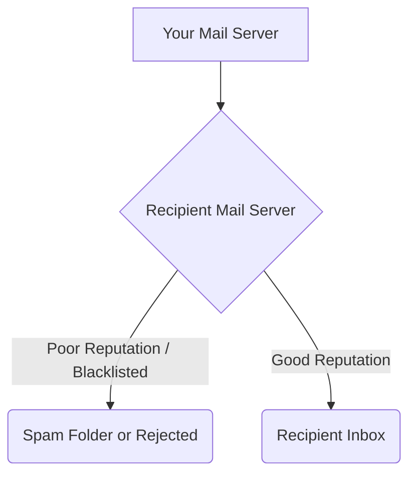
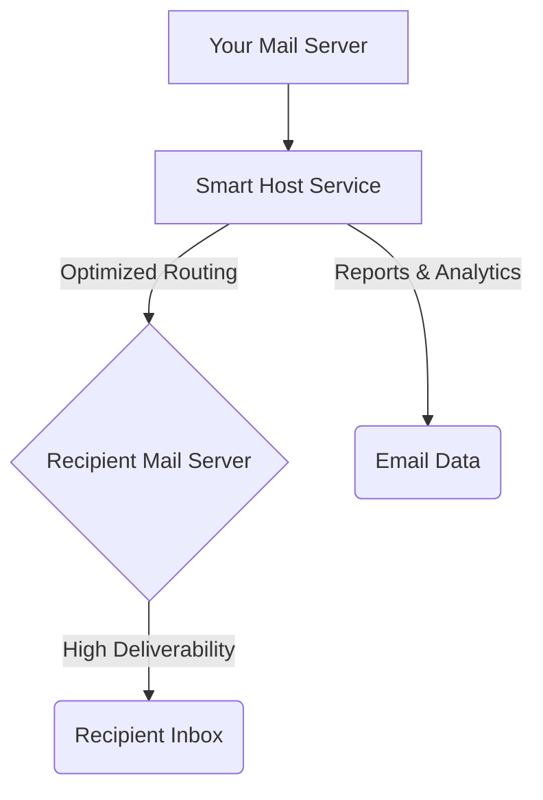

# Smart Hosts for Email Deliverability: A Comprehensive Guide

Email deliverability is a critical aspect of modern communication. Whether you're a small business sending marketing campaigns or a large enterprise managing transactional emails, ensuring your messages reach their intended recipients' inboxes is paramount. This is where **smart hosts** come into play.

## What are Smart Hosts and Which Problems Do They Solve?

A **smart host** (sometimes referred to as an SMTP relay) is a designated mail server that your local mail server uses to send outgoing email. Instead of sending emails directly to the recipient's mail server, your server forwards them to the smart host, which then handles the delivery.

### Email Flow Without a Smart Host

Here is a simplified diagram illustrating the email flow without a smart host, where local server reputation can directly impact deliverability:

### Email Flow With a Smart Host

And here's how the email flow changes when you route outgoing mail through a smart host, improving deliverability:

This approach solves several common problems related to email deliverability:

1.  **IP Reputation Issues:** If your server's IP address has a poor reputation (e.g., due to past spamming activities, shared hosting environment, or a new IP address), recipient mail servers might reject your emails or route them to spam folders. Smart hosts, especially those provided by reputable email service providers (ESPs), maintain excellent IP reputations, significantly improving your chances of inbox delivery.

2.  **Blacklisting:** Your server's IP address could inadvertently end up on a blacklist, preventing your emails from being delivered to certain domains. Smart hosts actively monitor and manage their IP addresses, ensuring they stay off blacklists.

3.  **Complex DNS Records (SPF, DKIM, DMARC):** Properly configuring SPF, DKIM, and DMARC records is crucial for email authentication and preventing spoofing. However, this can be complex. When using a smart host, much of this configuration and management is handled by the smart host provider, simplifying setup for your organization.

4.  **Rate Limiting and Throttling:** Many recipient mail servers impose limits on the number of emails they will accept from a single IP address within a specific timeframe. Exceeding these limits can lead to temporary rejections. Smart hosts are designed to handle high volumes of email and manage these rate limits efficiently, ensuring your emails are eventually delivered.

5.  **ISP-Specific Delivery Challenges:** Different Internet Service Providers (ISPs) have varying policies and technical requirements for email acceptance. Smart hosts have dedicated teams and infrastructure to navigate these complexities, optimizing delivery across a wide range of ISPs.

6.  **Scalability and Reliability:** Managing your own robust mail infrastructure for high-volume sending can be expensive and complex. Smart hosts offer scalable and highly reliable infrastructure, allowing you to send large quantities of email without worrying about server maintenance, outages, or capacity issues.

7.  **Analytics and Reporting:** Many smart host services provide detailed analytics and reporting on email delivery, bounces, opens, and clicks. This data is invaluable for understanding your email performance and identifying areas for improvement, something often lacking in direct sending from a local server.

## Real Use Cases for Different Businesses / Industries

Smart hosts are versatile and beneficial across a wide range of businesses and industries:

### 1. E-commerce Companies

*   **Problem Solved:** High volumes of transactional emails (order confirmations, shipping updates, password resets) and marketing campaigns (promotions, newsletters). Maintaining high deliverability is crucial for customer satisfaction and sales.
*   **Use Case:** An online retailer uses a smart host for all its outgoing email. This ensures that time-sensitive order confirmations reach customers immediately, and marketing emails land in the inbox, driving engagement and purchases. Without a smart host, their own web server's IP might get flagged due to volume, leading to lost sales and frustrated customers.

### 2. SaaS (Software as a Service) Providers

*   **Problem Solved:** Delivering application notifications, user onboarding emails, account alerts, and potentially high-volume usage reports. Reliability and speed are essential for user experience.
*   **Use Case:** A project management SaaS platform sends thousands of notification emails daily to its users about task updates, deadlines, and team communications. By routing these through a smart host, they minimize the risk of their notifications being blocked, ensuring users are always informed and engaged with the platform.

### 3. Healthcare Providers and Hospitals

*   **Problem Solved:** Sending appointment reminders, secure patient communications (within compliance guidelines like HIPAA), and internal administrative notices. Deliverability and security are paramount.
*   **Use Case:** A hospital system uses a smart host that offers advanced encryption and compliance features to send appointment reminders and important health updates to patients. This system helps them ensure that sensitive information is delivered reliably and securely, avoiding missed appointments and improving patient care.

### 4. Financial Institutions and Banks

*   **Problem Solved:** Sending account statements, security alerts, transaction notifications, and important customer service communications. Trust and deliverability are non-negotiable.
*   **Use Case:** A bank relies on a smart host to send two-factor authentication (2FA) codes and fraud alerts. The smart host's high deliverability rate ensures that critical security messages reach customers promptly, protecting their accounts and building trust.

### 5. Educational Institutions (Universities, Schools)

*   **Problem Solved:** Communicating with students, faculty, and parents regarding admissions, class schedules, emergency alerts, and administrative updates. Mass communication without hitting spam folders is vital.
*   **Use Case:** A university sends out semester registration deadlines, campus-wide announcements, and emergency notifications to tens of thousands of stakeholders. Using a smart host prevents these critical communications from being flagged as spam by various email providers used by students and staff, ensuring everyone stays informed.

### 6. Marketing Agencies

*   **Problem Solved:** Managing email campaigns for multiple clients, often involving varying volumes and diverse content. A strong IP reputation is essential for client success and agency reputation.
*   **Use Case:** A digital marketing agency manages email newsletters and promotional campaigns for a dozen clients. Instead of setting up individual SMTP servers for each client or risking their own IP reputation, they leverage a smart host optimized for marketing sends, ensuring high inbox rates for all their clients' campaigns.

### 7. Small Businesses / Startups

*   **Problem Solved:** Lack of dedicated IT resources to manage complex mail server configurations, low volume sending from potentially residential IPs, and the need for reliable communication with customers.
*   **Use Case:** A small online boutique sends out order confirmations and occasional promotional emails. Without the technical expertise or resources to manage their own mail server, they use a smart host to ensure their emails are delivered professionally and reliably, fostering customer trust and repeat business.

### Conclusion

Smart hosts are an indispensable tool in the modern email landscape. By offloading the complexities of email delivery to specialized providers, businesses of all sizes and across all industries can significantly improve their email deliverability, enhance their IP reputation, ensure compliance, and ultimately, communicate more effectively with their audience.